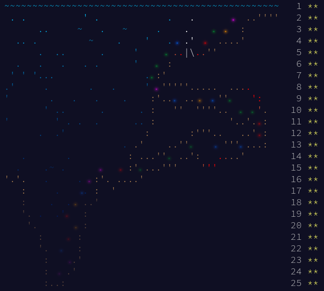

# Advent of Code 2021 - Haskell
Haskell Solutions for Advent of Code 2021 - https://adventofcode.com/



# Usage

## Run all days

```
cabal run ao21
```
```
--- Day 01 ---
1228
1257
--- Day 02 ---
2019945
1599311480
--- Day 03 ---
3374136
4432698
--- Day 04 ---
16674
7075
--- Day 05 ---
5167
17604
--- Day 06 ---
379114
1702631502303
--- Day 07 ---
340052
92948968
--- Day 08 ---
355
983030
--- Day 09 ---
591
1113424
--- Day 10 ---
319233
1118976874
--- Day 11 ---
1747
505
--- Day 12 ---
5333
146553
--- Day 13 ---
724
 ##  ###    ## ###  #### ###  #  # #
#  # #  #    # #  # #    #  # #  # #
#    #  #    # ###  ###  #  # #  # #
#    ###     # #  # #    ###  #  # #
#  # #    #  # #  # #    # #  #  # #
 ##  #     ##  ###  #### #  #  ##  ####

--- Day 14 ---
2360
2967977072188
--- Day 15 ---
621
2904
--- Day 16 ---
955
158135423448
--- Day 17 ---
12090
5059
--- Day 18 ---
3884
4595
--- Day 19 ---
425
13354
--- Day 20 ---
5479
19012
--- Day 21 ---
711480
265845890886828
--- Day 22 ---
580098
1134725012490723
--- Day 23 ---
22500
50270
--- Day 24 ---
Optimal model:
  s0   =                   9 :: Int64
  s1   =                   9 :: Int64
  s2   =                   6 :: Int64
  s3   =                   9 :: Int64
  s4   =                   1 :: Int64
  s5   =                   8 :: Int64
  s6   =                   9 :: Int64
  s7   =                   1 :: Int64
  s8   =                   9 :: Int64
  s9   =                   7 :: Int64
  s10  =                   9 :: Int64
  s11  =                   9 :: Int64
  s12  =                   3 :: Int64
  s13  =                   8 :: Int64
  test = 9223471728746755746 :: Word64
Optimal model:
  s0   =                   2 :: Int64
  s1   =                   7 :: Int64
  s2   =                   1 :: Int64
  s3   =                   4 :: Int64
  s4   =                   1 :: Int64
  s5   =                   1 :: Int64
  s6   =                   9 :: Int64
  s7   =                   1 :: Int64
  s8   =                   2 :: Int64
  s9   =                   1 :: Int64
  s10  =                   3 :: Int64
  s11  =                   9 :: Int64
  s12  =                   1 :: Int64
  s13  =                   1 :: Int64
  test = 9223399178045989719 :: Word64
--- Day 25 ---
513
```

## Run specific days
```
cabal run ao21 -- 01 02 12
```

# Tests

The minimal examples of each day are modeled as unit tests.
To run all the tests:

```
cabal test
```
or for a specific day:

```
cabal test --test-option 09
```

# ToDos/Improvements for next year:
- Add some more common utilities, like:
    - strip text (aka remove whitespace, very useful for parsing)
    - convert a binary number to decimal
- Add a mechanism for measuring runtime of each problem
- Write script to download and print input
- Fix the current Dijkstra implementation (Day 23 only runs through with nicuveo's one)
- Try to remove boilerplate of adding every day
